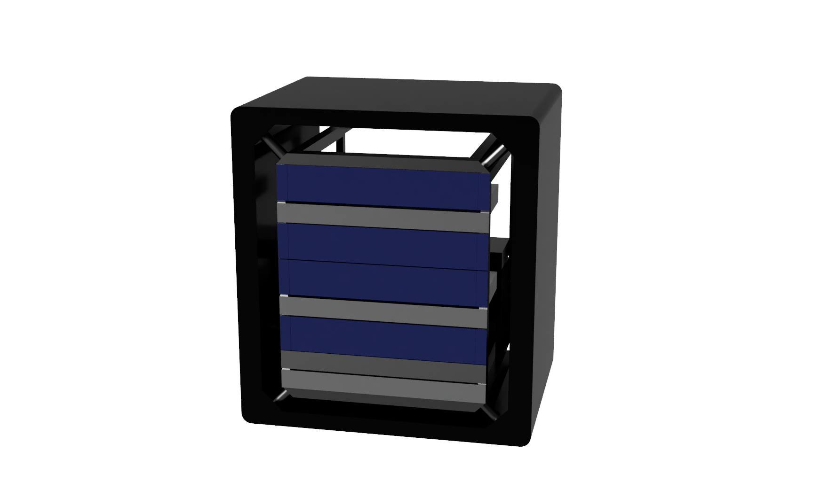

# Oracle's World's Largest Raspberry Pi Cluster (that we know of)

This Raspberry Pi cluster contains 1050 Raspberry Pi 3B+ running [Oracle Linux](https://www.oracle.com/linux/) and network booting each Pi. Many things have run on the cluster from custom
clustering software written by [Gluon](https://gluonhq.com) with a [JavaFX](https://openjfx.io) app and display, [SETTI@home](https://setiathome.berkeley.edu),
and [GraalVM](https://github.com/oracle/graal) running Java and [GraalPy](https://github.com/oracle/graalpython). Most of the time we disable 26 Pi to get a better number of Pi running on the cluster.

## Events

Oracle's World's Largest Raspberry Pi Cluster (that we know of) debuted at Open World/Java One 2019. Two smaller clusters called The Raspberry Pi Mini Super Computer containing 84 Pi went to Open World Dubai 2020 and Open World London 2020.

## Contributors

A lot of people helped make this happen. This is nowhere complete since we
had dozens of students from the Silicon Valley 42 school volunteer, Oracle
employees would bring their children as friend's well as friends and family
that just wanted to be involved. So thank you to (in order of involvement):

Chris Bensen
Stephen Chin
Gerald Venzl
Jasper Potts
Roy Feague
Vijay Kumar
Wim Coekaerts
Eric Sedlar
Blaine Carter
Yolande Poirier
Javed Mohammed
Linda Bronson
Jim Grisanzio
Johan Vos
José Pereda
Gerrit Grunwald
Igor Luccic
Mike Brave
Stuart Coggins
Wojciech Pluta
Jason Lowe
Bogdan Farca
Eli Schilling
